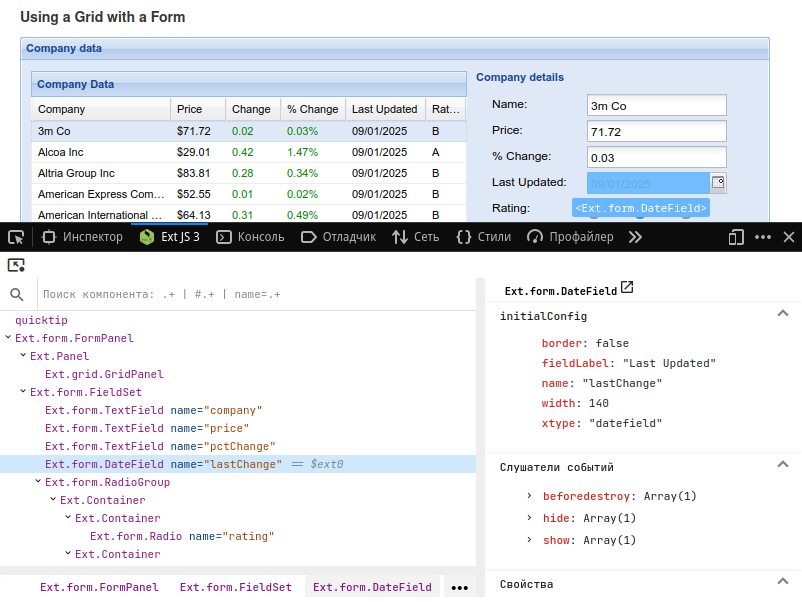
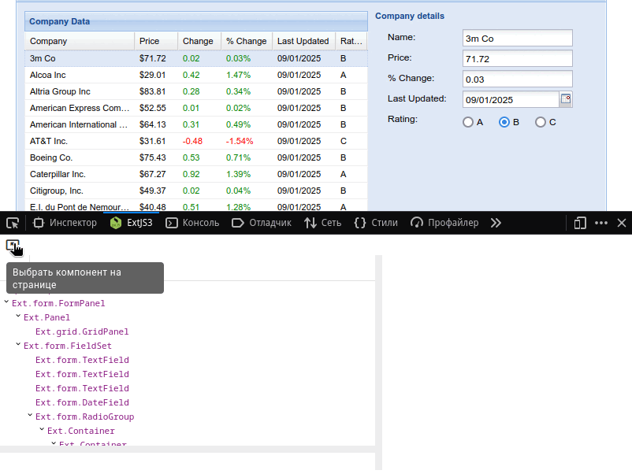
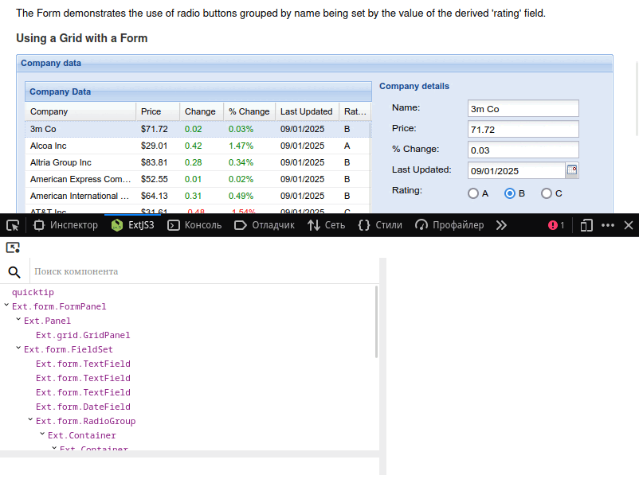
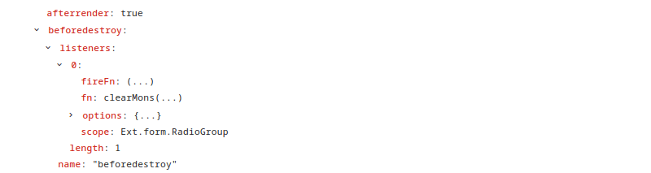
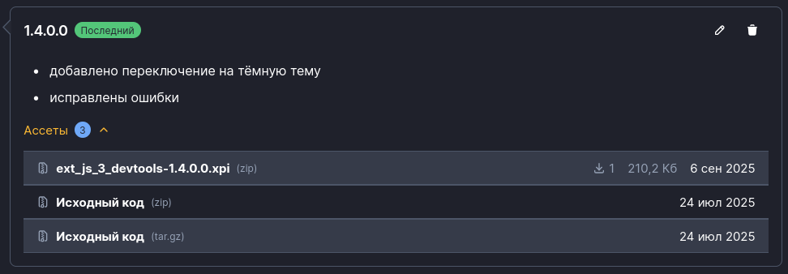

# Ext JS 3 DevTools

Firefox: https://addons.mozilla.org/en-US/firefox/addon/ext-js-3-devtools/  

## Может

### 1 Отображать дерево

### 2 Отображать свойства выбранного компонента

### 3 Поиск компонента
- поиск по классу: `DateField`
- поиск по имени: `name=lastChange`
- поиск по id: `#ext-comp-1004`

_поддерживаются регулярки_

### 4 Устанавливает переменную с выбранным компонентом

### 5 Выбрать компонент на странице

### 6 Показать компонент на странице

### 7 Открыть документацию по компоненту

### 8 Инспектировать html-элемент компонента

### 9 Инспектировать функции компонента


## Не может
варить кофе

## Установка
### 1. Установить через средства браузера
https://addons.mozilla.org/en-US/firefox/addon/ext-js-3-devtools/

### 2. Собранное расширение
Со страницы [релизов](https://github.com/3axapp/ext-js-3-devtools/releases) скачать файл `xpi` из `Assets`


### 3. Собрать и установить как временное расширение
Сборка
```shell
git clone git@github.com:3axapp/ext-js-3-devtools.git
cd ext-js-3-devtools
npm install
make
```
В FF перейти в `about:debugging#/runtime/this-firefox` и загрузить временное расширение из папки `dist`.  

_Подробнее:_ https://firefox-source-docs.mozilla.org/devtools-user/about_colon_debugging/index.html#this-firefox
