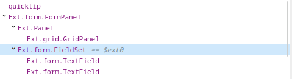
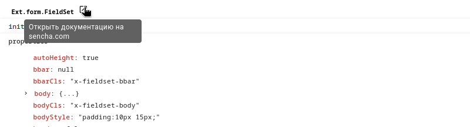
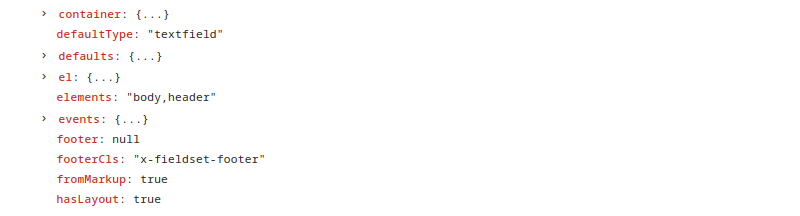

# Ext JS 3 DevTools

## Может

### 1 Отображать дерево 

### 2 Отображать свойства выбранного компонента

### 3 Устанавливает переменную с выбранным компонентом

### 4 Выбрать компонент на странице

### 5 Показать компонент на странице

### 6 Открыть документацию по компоненту

### 7 Инспектировать html-элемент компонента

### 8 Инспектировать функции компонента

## Не может
варить кофе
